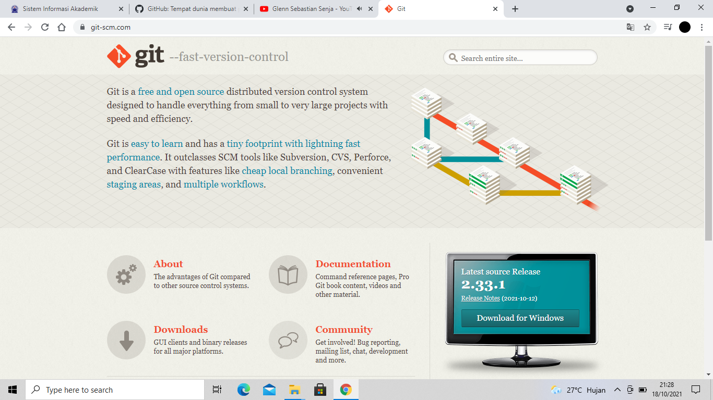
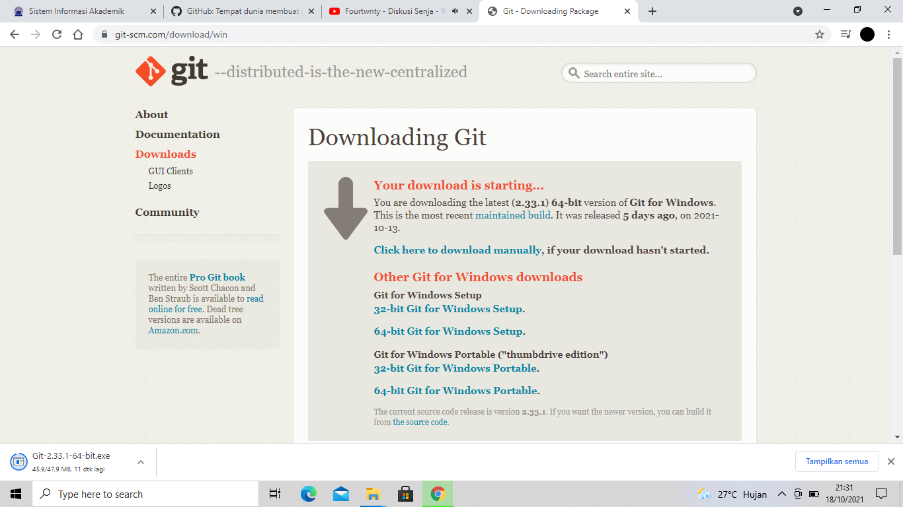
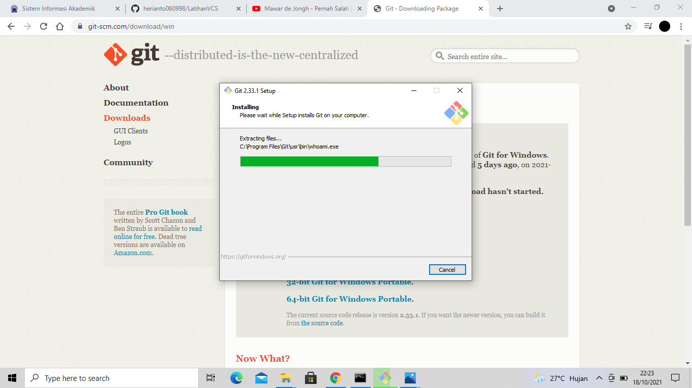
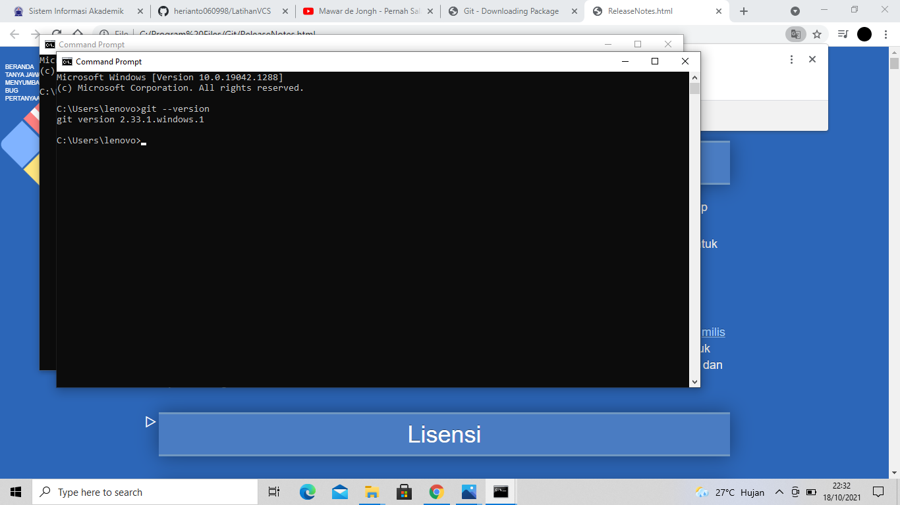
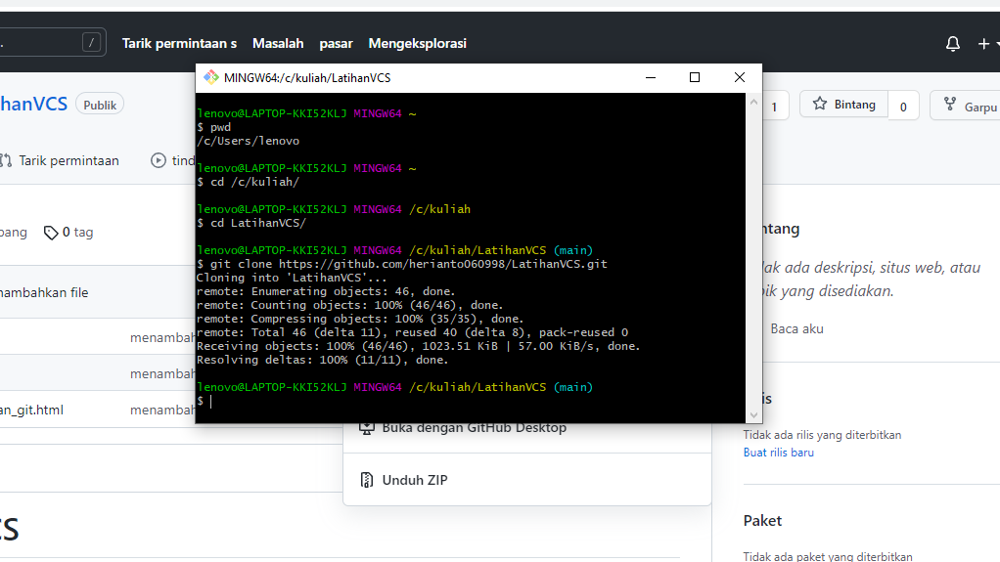
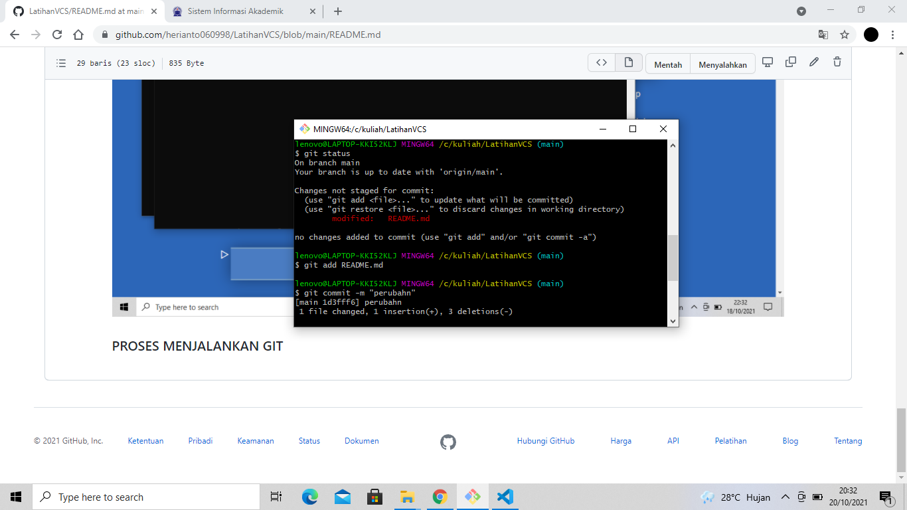

# LatihanVCS
## Tampilan gambar dan penjelasan

### PROSES MENGINSTAL GIT
ketik di kolom pencarian di google git-scm.com 

ini adalah tampilannya

### PROSES MENGINSTAL GIT
jika sudah muncul pada menu lalu klik "download for windows"

ini adalah tampilannya

### PROSES MENGINSTAL GIT
jika sudah di klik tinggal menunnggu proses download

ini adalah tampilannya

### PROSES MENGISTAL GIT
Jika sudah selesai mendownload klik "next" setiap tab lanjut menginstal git

ini adalah tampilannya

 
### PROSES MENGINSTAL GIT
cek apakah GIT sudah terinstal dengan cara "cmd > git version"

ini adalah tampilannya

### PROSES MENJALANKAN GIT
ketik git clone perintah untuk membuat working directory yang diambil dari repository server

tampilannya

### PROSES MENJALANKAN GIT
git status setelah melakukan perubahan pada README.md

git add README.md perintah untuk menambahkan file baru,atau ada perubahan pada file repository local menuju server repository

git commit -m "berisikan komentar" perintah untuk menyimpan perubahan kedalam database git

git push -u origin main perintah untuk mengirim perubahan pada repository local menuju server repository

tampilannyannya

### PROSES MENJALANKAN GIT

